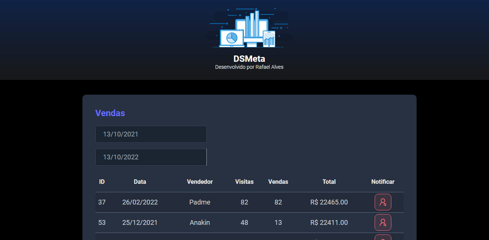

<h1 align="center">DS Meta</h1>

Projeto Fullstack de um sistema para monitorar o alcance das metas de vendas. O sistema está integrado com um banco de dados e conta com envio automático de SMS e implantação do front-end e back-end na nuvem.

<h1 align="center">
  
</h1>

<h1 align="center">
  
</h1>
 
### 🛠 Tecnologias:

As seguintes ferramentas foram usadas na construção do projeto:

### 💻 Demostração:

### 📝 Fases do projeto: 

- [x] Criar projetos back-end e front-end
- [x] Salvar os projeto no Github em monorepo
- [x] Montar o visual estático do front-end com base no figma
- [x] Criar projeto Spring Boot no Spring Initializr com as seguintes dependências:
    -	Web
    -	JPA
    -	H2
    -	Security
- [x] "Limpar" o projeto ReactJS e estilizar
- [x] Adicionar um seletor de data - Datepicker
- [x] React Hook useState para manter estado das datas
- [x] Implementar o back end
- [x] Acesso a banco de dados H2
- [x] Criar endpoints da API REST
- [x] Integração com SMS com Twilio
- [x] Implantação na nuvem com Heroku
- [x] Requisição com Axios e useEffect
- [x] Mensagem de confirmação com Toast 
- [x] Deploy no Netlify

---

### 🔗 Links usados durante o projeto:

 - [Modelo figma](https://www.figma.com/file/EN1zFtk4eY3Jgmpgi9YaMG/DSMeta1?node-id=0%3A1)
 - [Spring Initializr](https://start.spring.io/)
 - [Vite](https://vitejs.dev/guide/)
 - [Datepicker](https://github.com/Hacker0x01/react-datepicker)
 - [JpaRepository](https://www.youtube.com/watch?v=jh_T5_o3qKE)
 
---

### 👩🏽‍💻 Autor:

Projeto realizado por Rafael Alves Teixeira com a orientação do professor Nelio do canal DevSuperior.

